# Treffen 2025-01-15: 
## Inhalt
- Übersicht Fortschritt "Qualitative Analyse"
- Konkrete Ergebnisse aus Experimenten
- Fragen, Diskussion

## Übersicht Fortschritt "Qualitative Analyse"
- Datensatz: Lastdaten von 15 Haushalte für 90 000 viertelStunden (2 1/2 Jahre)
- Verschiedene HMM training mit unterschiedlichen Hyperparametern:
  - Anzahl Hidden States
  - Länge der Trainingszeitreihe
    - Out of memory Error 
  - Abstrahierung von Observation Space (auf 10er Watt)
    - keine signifikante Änderung der Rechenzeit
  - Hinzufügen von Zeitstempeln
- Prognose der Verteilung pro Zeitschritt
  - visualisiert via Violin Plots
- BIC/AIC nicht implementiert, da Größe vom StateSpace die Likelihood stark beinflusst

## Ergebnisse von Experimenten:

### Erste Plots:

- 100 states, 2 1/2 Jahre; Varianz Anfangs vergleichsweise groß
  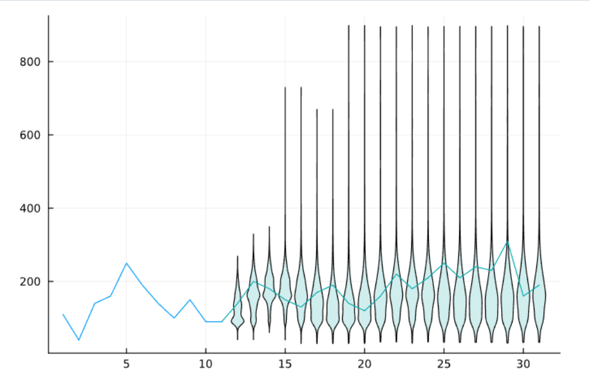
- Probleme mit Tagesphase und Saisonalität: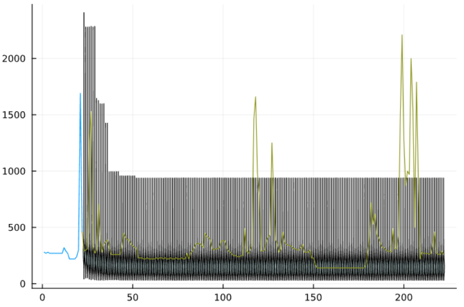

### Starke Abstrahierung der Beobachtungsdaten
- Bisher: Lastdaten einfach gerundet 
    =>  Integers in [0, ~5000] 
- Daten unterschiedlich zusammengefasst, zb alle 10Watts oder 100Watts
- Bsp starke Abstahierung (100 hidden, states, 26 observation states): 
  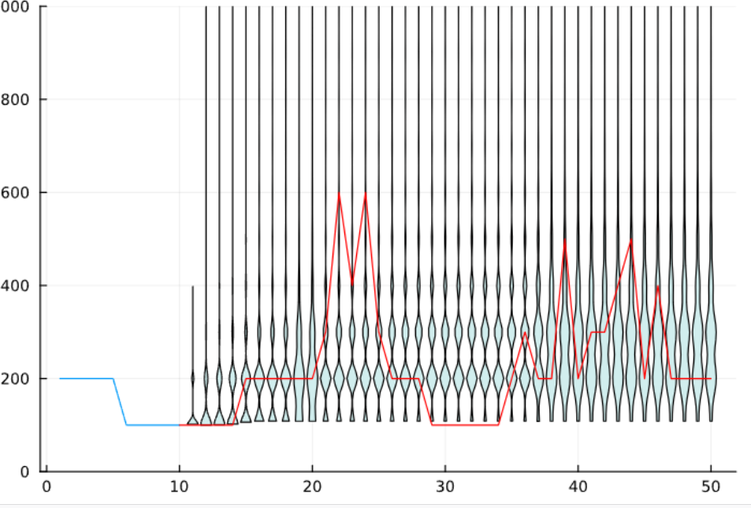
  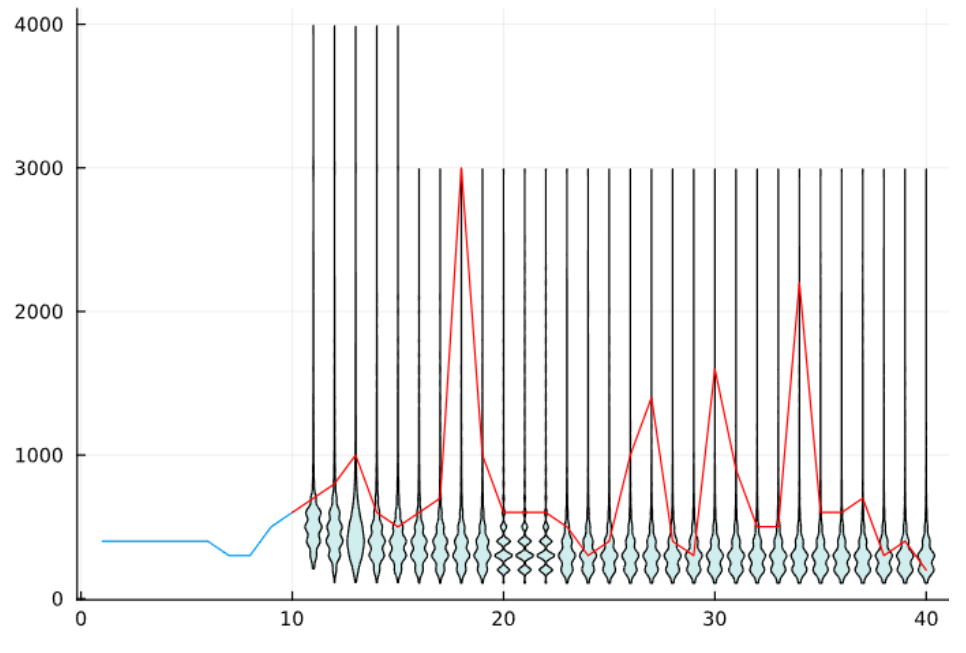
- Keinen Computation Benefit => schwächere Abstaktion auch möglich

### Experimente mit Timestamps
- Tag in Blöcke geteilt und als extra Info übergeben 
  - Bsp 6 Blöcke: 00:00-3:45 Block 1, 04:00 - 7:45 Block2,...
  - Trick um 2 dimensionalität umgangen: Timestamps 
- Model mit schwacher Abstaktion + Timestamps 4h Blocks
    - 100 States, 100iter, T = 10000, #obs = 651 
    - Leichter Tagesverlauf sichtbar; aber fährt sich trotzdem fest
    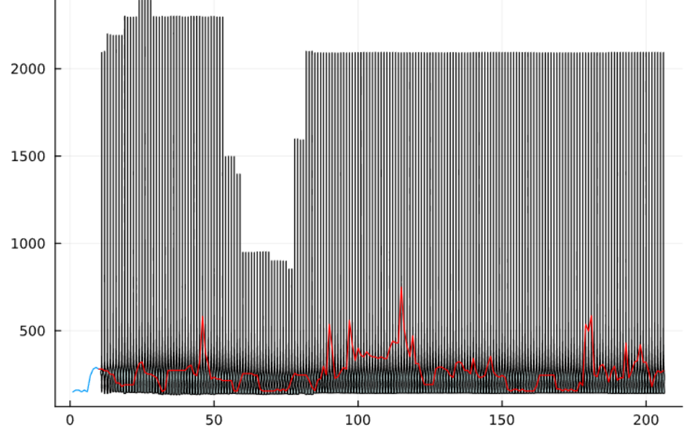 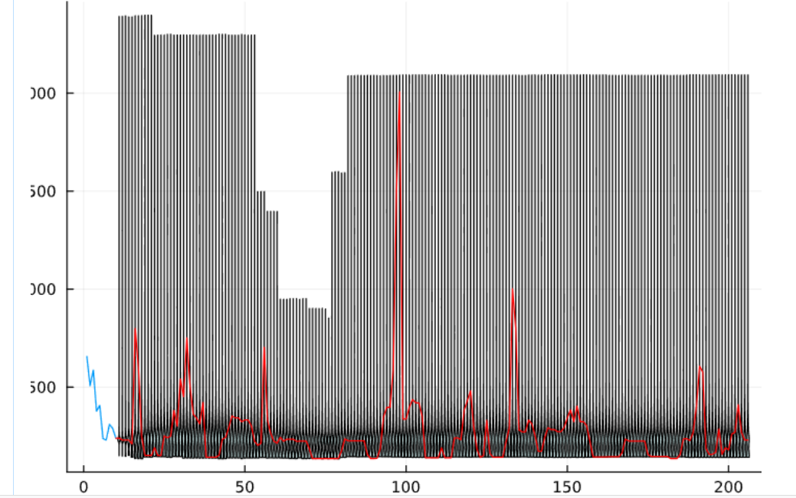
    - Auch besser Anfangsvarianz:
    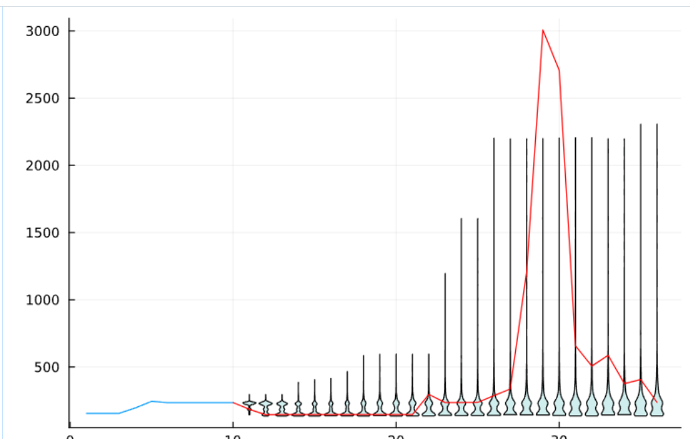 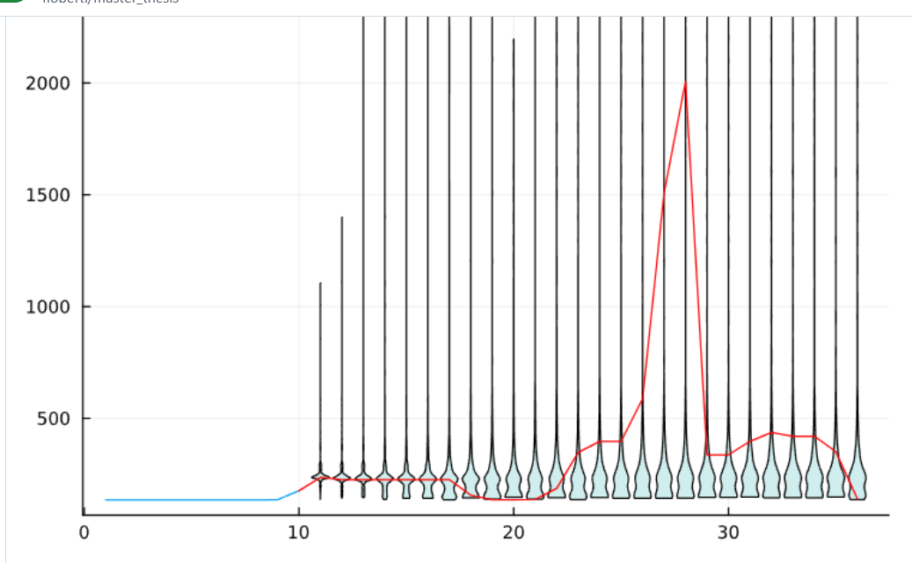 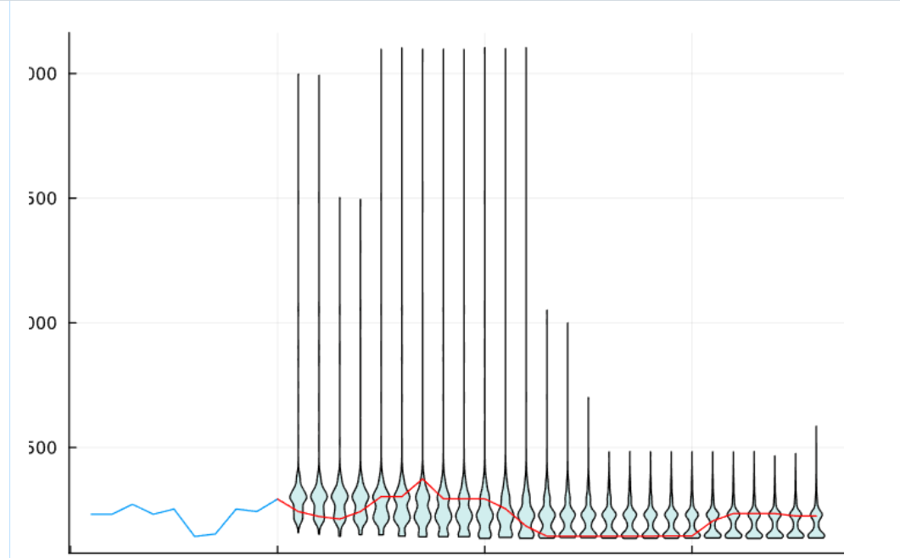

- Offene Probleme: 
  - Tagesmuster gut abbilden
  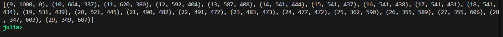
  - Saisonalität behandeln
  - Erkennung offensichtlicher Muster: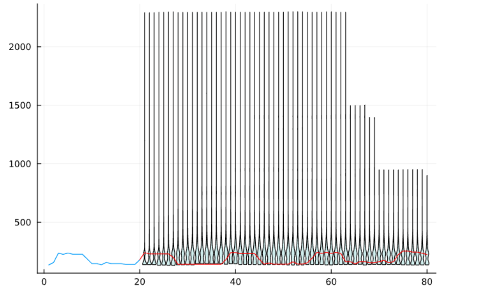

## Diskussion und Fragen
- Tagesmuster/Saisonalität
  - genauere Zeitdaten
  - Spezielleres HMM Modelle? (AR-HMM, Zyklische HMM)
  - Ideen zu Zeitreihe aufbereiten und filtern
    - Standardlastprofile/Durchschnittswerte abziehen
    - Differenzenfilter
    - Varianz normalisieren
- Evaluierung der Stochast. Prognose (nicht nur "mit Auge")
  - Was sollte die stoch.Prognose können und was nicht, bsp offensichtliche Muster
-

